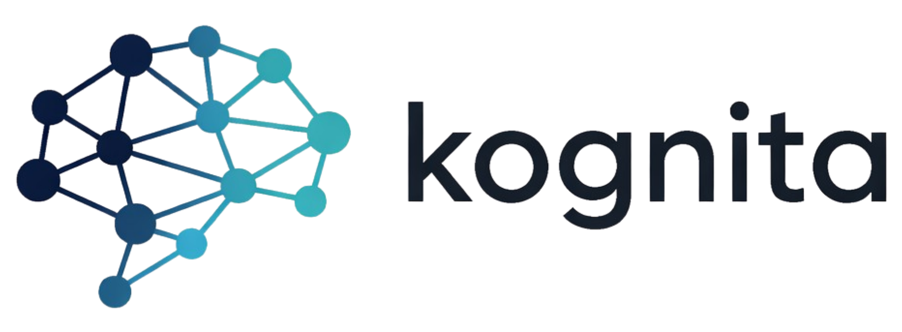

# Kognita — PDF → Knowledge Graph

[](https://pypi.org/project/kognita/)
[](https://pypi.org/project/kognita/)
[](https://opensource.org/licenses/MIT)
[](https://github.com/mze3e/kognita/actions/workflows/ci.yml)
[](https://pepy.tech/project/kognita)



**`kognita`** is a Python library that turns text blobs into queryable knowledge graphs. It wraps **Graphiti** (by Zep) as the graph engine and **KuzuDB** as the embedded graph database, with a pluggable LLM + embedder surface (Anthropic, OpenAI, Groq, Gemini, Ollama, or any OpenAI-compatible endpoint).

This repository ships two examples on top of the library:

- **`examples/streamlit_app/`** — the full PDF-to-knowledge-graph Streamlit UI documented below.
- **`examples/local_embedding_server/`** — an OpenAI-compatible embedding server so you can run everything offline.

---

## Features

### PDF Ingestion & Text Extraction

- Upload any PDF and Kognita extracts its full text using **PyMuPDF (fitz)**.
- Text is split into overlapping word-window chunks before being sent to the graph engine.
- Chunk size (words per chunk) and overlap are configurable in the sidebar.
- A preview of the extracted text is shown before processing begins.

### Knowledge Graph Building

- Each text chunk is fed to **Graphiti** as a text episode.
- Graphiti calls your chosen LLM to extract **entities** (nodes) and **relationships** (edges) from each chunk.
- Entities are deduplicated and merged automatically by Graphiti across chunks.
- The resulting graph is stored in a **KuzuDB** embedded database — no Docker or external services required.
- A live processing log shows each step: chunk sent, nodes and edges returned, errors if any.
- Processing automatically stops on the first provider API error and shows a clear message.
- **Resumable processing**: if processing is interrupted, a "Continue from chunk N" button resumes from where it stopped without losing progress.

### Multi-Provider LLM Support

The graph processing model is selected per-session. Available providers are detected automatically from configured API keys and running local services.

| Provider | Notes |
|---|---|
| **Anthropic (Claude)** | Requires `ANTHROPIC_API_KEY`. Models fetched live from the API. |
| **OpenAI (GPT)** | Requires `OPENAI_API_KEY`. Chat models fetched live. |
| **Groq** | Requires `GROQ_API_KEY`. Very fast and cheap. |
| **Google Gemini** | Requires `GOOGLE_API_KEY` or `GEMINI_API_KEY`. |
| **Ollama (local)** | Connect to a running Ollama instance. No API key needed. |
| **Custom OpenAI-compatible** | Point at any endpoint (vLLM, LM Studio, etc.) via env vars. |

### Multi-Provider Embedding Support

Embeddings are used by Graphiti for semantic search. The embedder is chosen independently of the LLM.

| Embedder | Notes |
|---|---|
| **OpenAI** | `text-embedding-3-small` (1536 dims). Requires `OPENAI_API_KEY`. |
| **Ollama** | `nomic-embed-text` or any model pulled locally (configurable). |
| **Local CPU server** | Run `examples/local_embedding_server/server.py` on your machine. Uses `BAAI/bge-small-en-v1.5` by default. |

### Saved Graphs & Deduplication

- Every successfully processed graph is **automatically saved to disk** (`.saved_graphs/`).
- Each saved graph stores: the original PDF, `graph_data.json` (nodes, edges, episodes), `metadata.json`, and the full KuzuDB directory.
- **PDF deduplication by hash**: uploading the same PDF again shows a prompt to load the existing graph instead of re-processing.
- Previously saved graphs can be reloaded from the sidebar dropdown at any time, restoring the full session (nodes, edges, episode log, KuzuDB for search).

### Interactive Graph Visualisation

- The graph is rendered with **Pyvis** using the vis.js engine directly in the browser.
- Node size scales with degree (highly connected entities appear larger).
- Hover over any node to see its name, summary, and labels.
- Hover over any edge to see the full extracted fact.
- Sidebar controls:
  - **Node colour** and **edge colour** pickers.
  - **Physics simulation** toggle (Barnes-Hut layout with tuned gravity/spring parameters).
  - **Edge label** toggle.
  - Drag, zoom, and pan the graph freely.

### Natural Language Search

- Enter a free-text query and Kognita runs a **semantic search** over the graph via Graphiti.
- Results are ranked and displayed as fact cards in the UI.
- Search requires an available embedding backend (Ollama, OpenAI, or the local server).

### LLM Playground

A full chat interface backed by the knowledge graph, accessible via the **LLM Playground** tab.

- **Chat with the knowledge graph**: ask questions in natural language. The assistant first runs a semantic graph search, injects the top results as context, then generates a response using the chosen LLM.
- **Graph snapshot fallback**: if semantic search returns no results, the LLM is given a compact structured snapshot of all entities and facts as context instead.
- Search results used for each answer are expandable inline.
- Chat history is preserved for the session (last 20 messages shown).
- Any available model (cloud or local) can be selected independently for playground queries.

### Kuzu Database Explorer

Directly query the underlying KuzuDB graph database with **Cypher** from inside the UI.

- A set of **predefined queries** covers common operations: count nodes/edges, find entities by name, list recent episodes, show extracted facts.
- A **custom query editor** lets you write any read-only `MATCH` or `CALL` Cypher query.
- Results are displayed as an interactive dataframe.

### Episode Log

The **Episode Log** tab shows the processing result for every chunk:

- Successful chunks show entity and edge counts and a text preview.
- Failed chunks show the error message.
- Each chunk has an expandable section listing every node and edge that was added, with names and fact text.

### All Facts View

The **All Facts** tab lists every extracted relationship as `Source → Target: fact`, making it easy to browse the full knowledge base.

### Export

Download the complete graph as a JSON file (`knowledge_graph.json`) containing all nodes (uuid, name, summary, labels) and edges (uuid, source, target, fact, name).

### Cost Estimation & Pricing

- The sidebar shows **real-time input/output pricing** for the selected processing model.
- A **pricing modal** compares all supported models side-by-side across Anthropic, OpenAI, Groq, and Google.

### Health Check Sidebar

The sidebar shows live status for every configured provider:

- Anthropic / OpenAI / Groq / Gemini API key present
- Ollama reachable + number of LLMs available
- Local CPU embedder reachable
- Custom OpenAI endpoint configured
- Total models and embedding backends available

---

## Install

### As a library

```bash
pip install kognita
```

```python
import asyncio
from kognita import Kognita, KognitaConfig, LLMConfig, EmbedderConfig

async def main():
    cfg = KognitaConfig(
        llm=LLMConfig(provider="anthropic", api_key="…", model="claude-3-5-sonnet-20241022"),
        embedder=EmbedderConfig(provider="openai", api_key="…", model="text-embedding-3-small", dimension=1536),
        db_path="./my_graph.kuzu",
    )
    async with Kognita(cfg) as kg:
        await kg.ingest_text("Einstein published relativity in 1905…", source="einstein")
        hits = await kg.search("What did Einstein discover?")
        snapshot = kg.export()

asyncio.run(main())
```

### Run the Streamlit demo

```bash
pip install -e ".[demo]"
streamlit run examples/streamlit_app/app.py
```

### Run the local embedding server

```bash
pip install -e ".[local-embeddings]"
uvicorn examples.local_embedding_server.server:app --host 127.0.0.1 --port 8000
```

---

## API Keys

| Variable | Used for |
|---|---|
| `ANTHROPIC_API_KEY` | Claude models (entity extraction, chat) |
| `OPENAI_API_KEY` | GPT models + `text-embedding-3-small` embeddings |
| `GROQ_API_KEY` | Groq-hosted LLMs |
| `GOOGLE_API_KEY` or `GEMINI_API_KEY` | Google Gemini models |

Set these as environment variables or place them in a `.env` file.

---

## Local & Custom Endpoints

### Ollama (fully local)

```bash
ollama pull llama3.2:3b
ollama pull nomic-embed-text
```

Optional env overrides:

```bash
OLLAMA_BASE_URL=http://localhost:11434
OLLAMA_LLM_MODEL=llama3.2:3b
OLLAMA_EMBED_MODEL=nomic-embed-text
OLLAMA_EMBED_DIM=768
```

`OLLAMA_BASE_URL` accepts both `http://localhost:11434` and `http://localhost:11434/v1`.

### Local CPU embedding server

Run a small FastAPI embedding server on your CPU (no GPU required):

```bash
pip install -e ".[local-embeddings]"
uvicorn examples.local_embedding_server.server:app --host 127.0.0.1 --port 8000
```

Optional env overrides:

```bash
LOCAL_EMBEDDING_MODEL=BAAI/bge-small-en-v1.5
LOCAL_EMBEDDINGS_BASE_URL=http://localhost:8000/v1
LOCAL_EMBEDDINGS_MODEL=bge-small-en-v1.5
LOCAL_EMBEDDINGS_DIM=384
```

When reachable, `local:bge-small-en-v1.5` appears in the embedder dropdown.

### Custom OpenAI-compatible endpoint

```bash
CUSTOM_OPENAI_BASE_URL=https://my-server/v1
CUSTOM_OPENAI_API_KEY=your-key
CUSTOM_OPENAI_EMBED_MODEL=text-embedding-3-small
CUSTOM_OPENAI_EMBED_DIM=1536
```

`CUSTOM_OPENAI_ENDPOINT` is accepted as an alias for `CUSTOM_OPENAI_BASE_URL`.

---

## Tips

- **Chunk size**: 200–300 words works well for most documents. Smaller chunks extract more fine-grained facts; larger chunks give more context per episode.
- **Overlap**: 25–30 words helps preserve context at chunk boundaries.
- Each episode costs ~2–5 LLM calls (extraction + entity resolution + deduplication).
- For large PDFs (50+ pages), expect 2–5 min processing time with a cloud model.
- Use Groq models for the cheapest cloud option.
- Use Ollama or the local CPU embedder for fully offline, zero-cost processing.
- Use the **Export** button to download the graph as JSON for further analysis or to load into another tool.
- Saved graphs persist between sessions — you only pay to process each PDF once.
